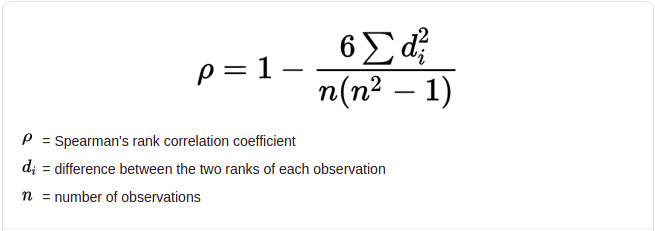

# What is Covariance ?
In probability theory and statistics, covariance is a measure of the joint variability of two random variables. If the greater values of one variable mainly correspond with the greater values of the other variable, and the same holds for the lesser values (that is, the variables tend to show similar behavior), the covariance is positive. In the opposite case, when the greater values of one variable mainly correspond to the lesser values of the other, (that is, the variables tend to show opposite behavior), the covariance is negative. The sign of the covariance therefore shows the tendency in the linear relationship between the variables. The magnitude of the covariance is not easy to interpret because it is not normalized and hence depends on the magnitudes of the variables. The normalized version of the covariance, the correlation coefficient, however, shows by its magnitude the strength of the linear relation.

Covariance is a measure of how much two random variables vary together. It’s similar to variance, but where variance tells you how a single variable varies, co variance tells you how two variables vary together.

<figure>
<h3>Covariance</h3>
  
</figure>

## Problems with Interpretation

A large covariance can mean a strong relationship between variables. However, you can’t compare variances over data sets with different scales (like pounds and inches). A weak covariance in one data set may be a strong one in a different data set with different scales.

The main problem with interpretation is that the wide range of results that it takes on makes it hard to interpret. For example, your data set could return a value of 3, or 3,000. This wide range of values is cause by a simple fact; The larger the X and Y values, the larger the covariance. A value of 300 tells us that the variables are correlated, but unlike the correlation coefficient, that number doesn’t tell us exactly how strong that relationship is. The problem can be fixed by dividing the covariance by the standard deviation to get the correlation coefficient known as Pearson correlation coefficient.

 
 

# Pearson correlation coefficient
Pearson's correlation coefficient is the covariance of the two variables divided by the product of their standard deviations. The form of the definition involves a "product moment", that is, the mean (the first moment about the origin) of the product of the mean-adjusted random variables; hence the modifier product-moment in the name.

Correlation coefficients are used to measure how strong a relationship is between two variables. There are several types of correlation coefficient, but the most popular is Pearson’s. Pearson’s correlation (also called Pearson’s R) is a correlation coefficient commonly used in linear regression. If you’re starting out in statistics, you’ll probably learn about Pearson’s R first. In fact, when anyone refers to the correlation coefficient, they are usually talking about Pearson’s.

<figure>
<h3>Pearson correlation coefficient</h3>
  
</figure>

## Potential problems with Pearson correlation.
The PPMC is not able to tell the difference between dependent variables and independent variables. For example, if you are trying to find the correlation between a high calorie diet and diabetes, you might find a high correlation of .8. However, you could also get the same result with the variables switched around. In other words, you could say that diabetes causes a high calorie diet. That obviously makes no sense. Therefore, as a researcher you have to be aware of the data you are plugging in. In addition, the PPMC will not give you any information about the slope of the line; it only tells you whether there is a relationship.

 
 

# Spearman's rank correlation coefficient

In statistics, Spearman's rank correlation coefficient or Spearman's <i>ρ</i>, named after Charles Spearman and often denoted by the Greek letter <i>ρ</i>  (rho) or as <i>rs</i>, is a nonparametric measure of rank correlation (statistical dependence between the rankings of two variables). It assesses how well the relationship between two variables can be described using a monotonic function.

The Spearman correlation between two variables is equal to the Pearson correlation between the rank values of those two variables; while Pearson's correlation assesses linear relationships, Spearman's correlation assesses monotonic relationships (whether linear or not). If there are no repeated data values, a perfect Spearman correlation of +1 or −1 occurs when each of the variables is a perfect monotone function of the other.

The Spearman rank correlation coefficient, <i>rs</i>, is the nonparametric version of the Pearson correlation coefficient.

<figure>
<h3>Spearman's rank correlation coefficient</h3>
  
</figure>

 
 

# Plot

<figure>
<h3>Covariance, Pearson correlation, and Spearman's rank correlation</h3>
  
</figure>

 
 

# References

## Covariance

[Khan Academy](https://www.khanacademy.org/math/statistics-probability/describing-relationships-quantitative-data/more-on-regression/v/covariance-and-the-regression-line)

[Covariance - Wiki](https://en.wikipedia.org/wiki/Covariance)

[Statistics How To](https://www.statisticshowto.com/probability-and-statistics/statistics-definitions/covariance/)

 

## Pearson correlation coefficient
[Khan Academy](https://www.khanacademy.org/math/ap-statistics/bivariate-data-ap/correlation-coefficient-r/v/calculating-correlation-coefficient-r)

[Pearson correlation coefficient - Wiki](https://en.wikipedia.org/wiki/Pearson_correlation_coefficient)

[Statistics How To](https://www.statisticshowto.com/probability-and-statistics/correlation-coefficient-formula/)

 

## Spearman's rank correlation coefficient
[Spearman's rank correlation coefficient - Wiki](https://en.wikipedia.org/wiki/Spearman%27s_rank_correlation_coefficient)

[Statistics How To](https://www.statisticshowto.com/probability-and-statistics/correlation-coefficient-formula/spearman-rank-correlation-definition-calculate/)
